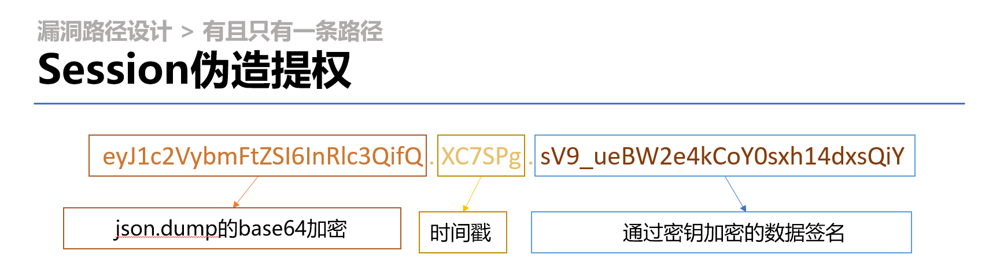

# [官方发布] DiagonAlley 漏洞环境的手动攻击流程

exp脚本请参见 [链接](EXP/exp.py)。我们这里仅说明如何进行手动攻击。

## 环境搭建

我们推荐使用我们已开发好的docker环境进行搭建。

```bash
$ docker pull registry.cn-hangzhou.aliyuncs.com/lyulumos/diagonalley:0.1
$ docker run -it --rm -p 80:80 registry.cn-hangzhou.aliyuncs.com/lyulumos/diagonalley:0.1
```

当然也可以直接从源代码运行。

```bash
$ git clone https://github.com/LyuLumos/A-Leaky-Web-Environment.git
$ cd DiagonAlley
$ pip install -r requirements.txt
$ flask run
```

## 第一步：绕过登录

为了限制用户的攻击路径，在漏洞环境中我们关闭了注册界面，同时设定了其他页面的跳转，保证未登录用户无法进行其他操作。尝试提交的时候可以发现数据以get参数的形式提交，我们推荐使用 `sqlmap` 进行攻击，通过 `sqlmap` 可以看到整个数据库里面所有信息。

(本地测试阶段，与实际数据库信息不同)


当然手动尝试sql注入也是可行的，对于我们的环境，一个可行的payload为：

```bash
login?Email=1 or 1=1 or 1=1
```

## 第二步：提权

<!-- http://106.14.163.104/login?Email=1%20or%201=1%20or%201=1 -->

登录进我们的主页面之后，后面的步骤需要尝试寻找，提示隐藏在各个角落。


**提示1：页脚**


**提示2：活点地图（即第一个图片本身）**

我们下载这张图片，会发现图片的最后是嵌入了一句编码的，观察可以发现其实是base32编码。

```bash
$ strings Marauders_Map_Scaled_large.png | tail -n 1 | base32 -d
# SECRET_KEY = TH15_15_N0T_F14G!
```

**提示3：入学通知书**

谁不想收到来自霍格沃茨的入学通知书呢？通过查看源码可以发现一个奇奇怪怪的提示，其实就是信息的编码方式。


我们搜索相关网页，直接进行解码，可以得到和提示2相同的信息。


所以我们收集现有的提示得到的方向是：通过 `SECRET_KEY` 提权。

下一步，不管是通过搜索还是经验，其实都指向，`flask-session` 的编解码。

（图源：答辩所用PPT，受限于文件大小，不作上传）


在GitHub上搜索，可以找到许多工具，这里我们[随便使用一个](https://github.com/noraj/flask-session-cookie-manager)，传入 `BurpSuite` 截获的 `session` 。


我们的目的是要提权，即将 `auth` 的值改为 1。

这里要额外注意，由于编解码所用的js语言和python语言对 `True` 和 `true` 的写法不同，所以需要进行大小写替换，这也是提示1所写的第一句的目的。

将伪造完的session传入，会发现用户名旁边出现了新的 `抢购商品` 按钮。


## 第三步：购买商品


我们要购买最后的商品，但是**提示写明：`2022年1月1日起允许购买`。**

我们尝试点击 `购买` 按钮，发现其指向一个带有 `Time` 参数的链接。

```bash
http://106.14.163.104/finalbuy?Time=1626684024
```

很容易猜到后台有 `timestamp` 的比较，那其实思路就很简单了，无论是使用BP还是直接手动在地址栏里面输入一个比2022年1月1日时间戳大的数字就行了。

最终界面的展示。


