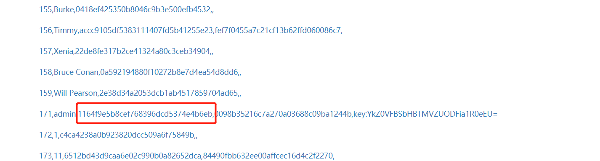
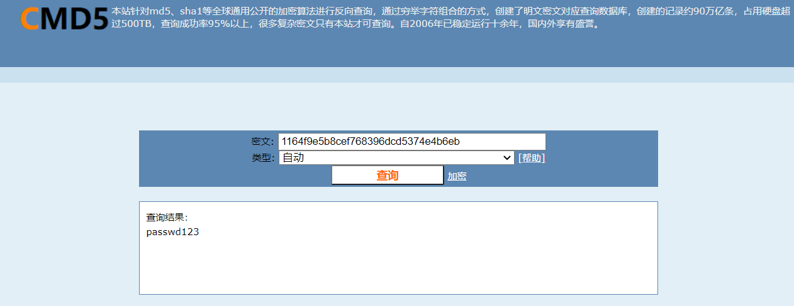
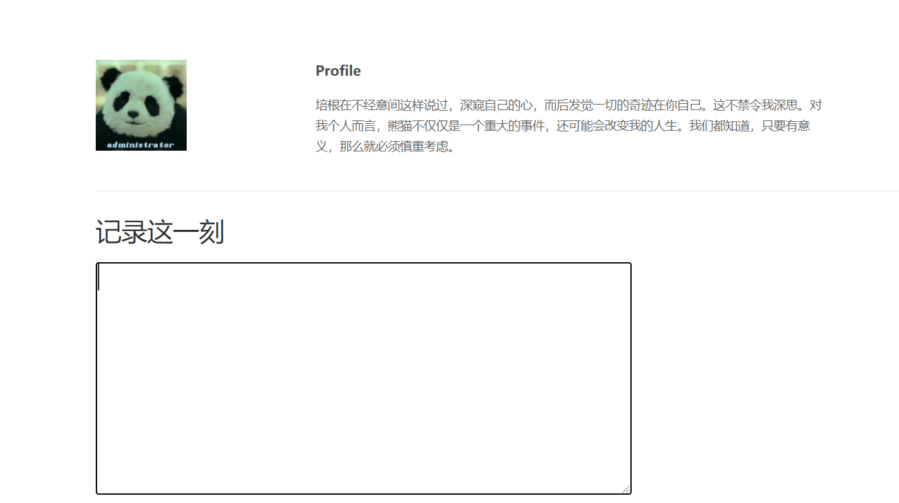

# 对王冬霞组搭建环境的攻击流程

## 环境准备

首先根据群里面的文件进行漏洞环境的搭建。注意群内发的源文件存在一定问题，更改如下

```diff
line 17
- container_name: mysql
+ container_name: kate123wongmysql
```

`docker-compose up` 即可。

## 流程

1. 首先登入界面，是一个用户登录界面没有账号所以我们首先注册一个。


2. 登入之后发现是一个搜索框，按照提示搜索自己的名字后，发现返回了一堆字符串，分别是 `id|password|session`，尝试进行sql注入。



  发现了admin的相关信息，尤其是以key最为瞩目，虽然后续并没有什么用。

3. 我们将admin的密码扔到cmd5解码。



4. 以admin的身份登录，进入最终的界面。经询问以下界面即为最终界面。



## 其他

- 这个环境不论是在校园网上还是docker上，都贼容易卡。。。。。