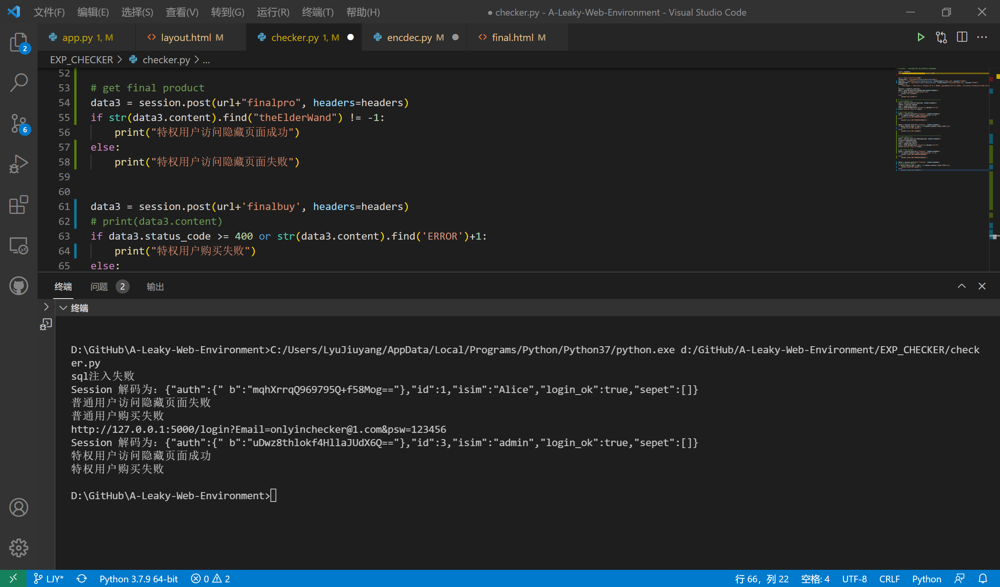

# FixIt 技术总结报告

- [FixIt 技术总结报告](#fixit-技术总结报告)
  - [Diff](#diff)
  - [修复思路和流程](#修复思路和流程)
    - [sql注入修复](#sql注入修复)
    - [Session伪造提权](#session伪造提权)
    - [修改传参方式](#修改传参方式)
  - [其他一些不同的地方](#其他一些不同的地方)
  - [CHECKER](#checker)

## Diff

下面是漏洞环境和修复环境的[diff结果](diff.patch)，后面我们会逐段说明。

```bash
root@LAPTOP-AH86KF83:/mnt/d/GitHub# 
diff -ruN A-Leaky-Web-Environment/DiagonAlley/ fixed/A-Leaky-Web-Environment/DiagonAlley/ > diff.patch
```


## 修复思路和流程

### sql注入修复
```diff
@@ -102,15 +102,12 @@
         # print("pas="+str(pas))
         pas = hashlib.sha256(str(pas).encode("utf-8")).hexdigest()
         # print(em, pas)
-        cur = conn.cursor()
-        cur.execute("select * from user where email={email} and passwd= '{passwd}'"
-                    .format(email=em, passwd=pas))
-        ans = cur.fetchall()
-        if len(ans):
+        if User.query.filter_by(email=em, passwd=pas).first():
+            user = User.query.filter_by(email=em, passwd=pas).first()
             session['login_ok'] = True
-            session['isim'] = ans[0][1]
-            session['id'] = ans[0][0]
-            session['auth'] = ans[0][4]
+            session['isim'] = user.name
+            session['id'] = user.id
+            session['auth'] = enc(user.auth)
             session['sepet'] = carts
             return redirect(url_for('index2'))
         else:
```

解决方法很简单，将字符串拼接改为传参。

### Session伪造提权

进行这种操作的核心在于，需要拿到 Session 的 `SECRET_KEY`，那么比较暴力的做法是，直接删除掉现有的提示（无法得到`SECRET_KEY`）或者配置SSL（Cookie加密，无法识别），但是这和黄大所说的「拔网线」基本是一个道理。

因此，我们进行的修复措施是，对关键信息进行加密，这里我采用的是 AES算法的CBC模式。

这里先偏个题，其实从原理上来说，对关键信息进行哈希也可以达到相同的目的。简单使用sha256或者其他散列算法是不可行的，因为我们的数据原文太过于简单（0或1），很容易被彩虹表算出来。因此需要进行加盐哈希。

使用AES的另一个好处是，如果将来auth项需要存储更多的信息，也可以进行加解密的处理。

加解密的python文件在diff.patch文件第59行至89行完整列出。

对应的，我们需要在使用关键信息时进行加解密。包括登录部分的 `auth` 字段值也要进行更改。

```diff
@@ -342,7 +339,7 @@
 @app.route('/finalpro', methods=['GET', 'POST'])
 def finp():
     if 'login_ok' in session:
-        if(session['login_ok'] == True and str(session['auth']) == '1'):
+        if(session['login_ok'] == True and dec(session['auth'])=='1'):
             return render_template('final.html')
         else:
             return redirect(url_for('index'))
@@ -354,9 +351,8 @@
 @app.route('/finalbuy', methods=['GET', 'POST'])
 def fin():
     if 'login_ok' in session:
-        if(session['login_ok'] == True and str(session['auth']) == '1'):
+        if(session['login_ok'] == True and dec(session['auth'])=='1'):
            ...
```

### 修改传参方式

这里我们进行的措施是，将当前时间放在后端计算，避免传参。

```diff
@@ -354,9 +351,8 @@
@app.route('/finalbuy', methods=['GET', 'POST'])
 def fin():
     if 'login_ok' in session:
-        if(session['login_ok'] == True and str(session['auth']) == '1'):
-            ans = request.args.get('Time') if request.args.get('Time') else "0"
-            if int(ans) < int('1640966400'): # 2022.1.1 00:00:00
+        if(session['login_ok'] == True and dec(session['auth'])=='1'):
+            if int(time.time()) < int('1640966400'): # 2022.1.1 00:00:00
                 return render_template('lost.html')
             else:
                 return render_template('flag.html')

@@ -54,7 +54,7 @@
<div class="product_buttons">
        <div class="text-right d-flex flex-row align-items-start justify-content-start" >
                <div class="product_button product_cart text-center d-flex flex-column align-items-center justify-content-center" style="border-left:solid 1px #ededed">
-                         <div><div><a href="/finalbuy?Time=1626684024"></a></div></div>
+                         <div><div><a href="/finalbuy"></a></div></div>
                </div>
        </div>
</div>               
```

## 其他一些不同的地方

- `database.db`： 为了测试checker的有效性，在数据库中添加了 `auth=1` 的管理员。但是在漏洞环境中所有的用户  `auth` 值都为0。
- 一些图片文件的不同：写文档时未同步的少数图片，不影响代码。

## CHECKER

`checker` 文件的源代码在[这里](CHECKER/checker.py)，check修复环境运行结果如下：



我们可以看到，`auth` 字段信息变为不可读，只有特权用户（`auth=1`）才能访问到最终商品购买界面，但是因为时间未到也无法进行购买。