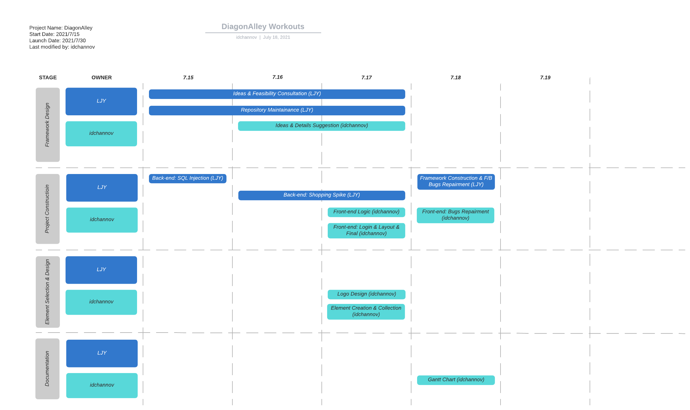
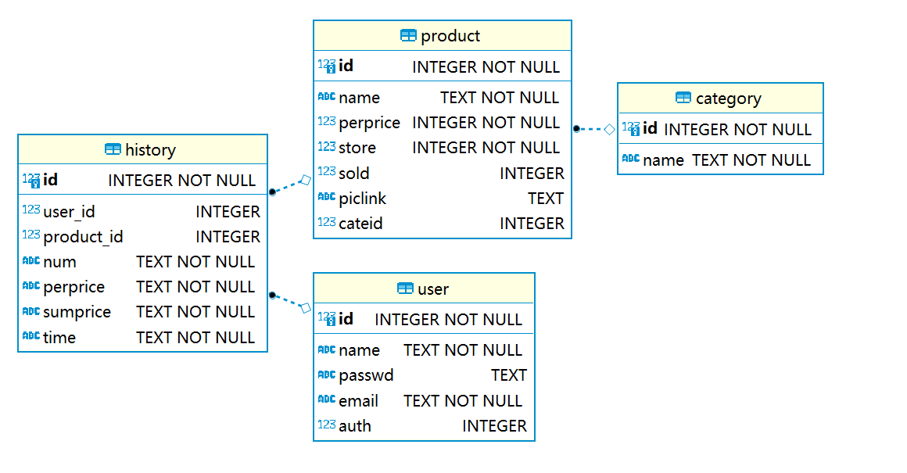
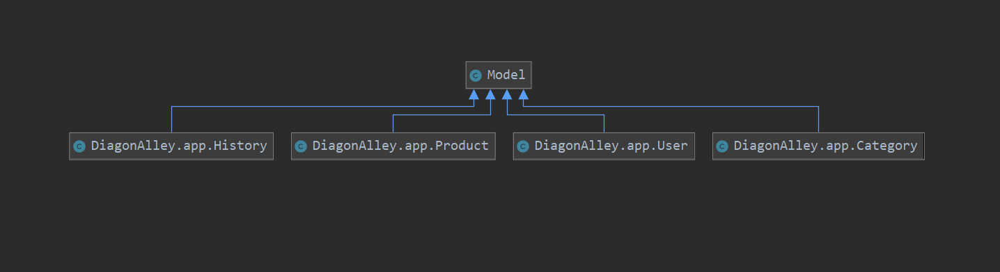
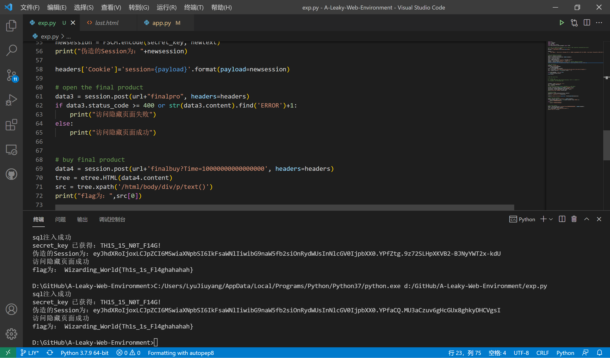

#  DiagonAlley

- [!DIagonAlley-Logo DiagonAlley](#-diagonalley)
  - [Rules](#rules)
  - [TBD](#tbd)
  - [To-do list](#to-do-list)
  - [Set up the Environment](#set-up-the-environment)
  - [Gantt Chart](#gantt-chart)
  - [Database E-R](#database-e-r)
  - [EXP & CHECKER](#exp--checker)

## Rules

- [创新实践能力团队赛评分标准](https://c4pr1c3.github.io/cuc-wiki/cp/assessment.html)

## TBD
- [讨论区](https://github.com/LyuLumos/A-Leaky-Web-Environment/discussions)

## To-do list
- [ ] 功能
- [ ] 文档
  - [ ] 需求分析、（概要和详细）设计文档
  - [ ] API 接口设计说明
  - [ ] 必要的插图或表格
  - [ ] 人员分工说明
- [ ] 其他
  - [x] EXP
  - [ ] Checker

## Set up the Environment
```bash
cd DiagonAlley
pip install -r requirements.txt
flask run
```

## Gantt Chart



## Database E-R



Database UML



## EXP & CHECKER

```bash
cd EXP
pip install -r requirements.txt
python3 exp.py
python3 cheker.py
```



