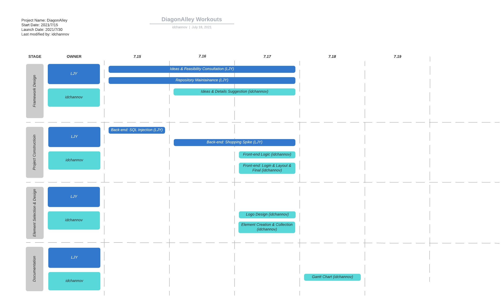

#  DiagonAlley

## Rules

- [创新实践能力团队赛评分标准](https://c4pr1c3.github.io/cuc-wiki/cp/assessment.html)

## TBD
- [讨论区](https://github.com/LyuLumos/A-Leaky-Web-Environment/discussions)

## To-do list
- [ ] 功能
- [ ] 文档（[GitHub Wiki](https://github.com/LyuLumos/A-Leaky-Web-Environment/wiki)）
  - [ ] 需求分析、（概要和详细）设计文档
  - [ ] API 接口设计说明
  - [ ] 必要的插图或表格
  - [ ] 人员分工说明
- [ ] 其他
  - [ ] EXP

## Gantt Chart

